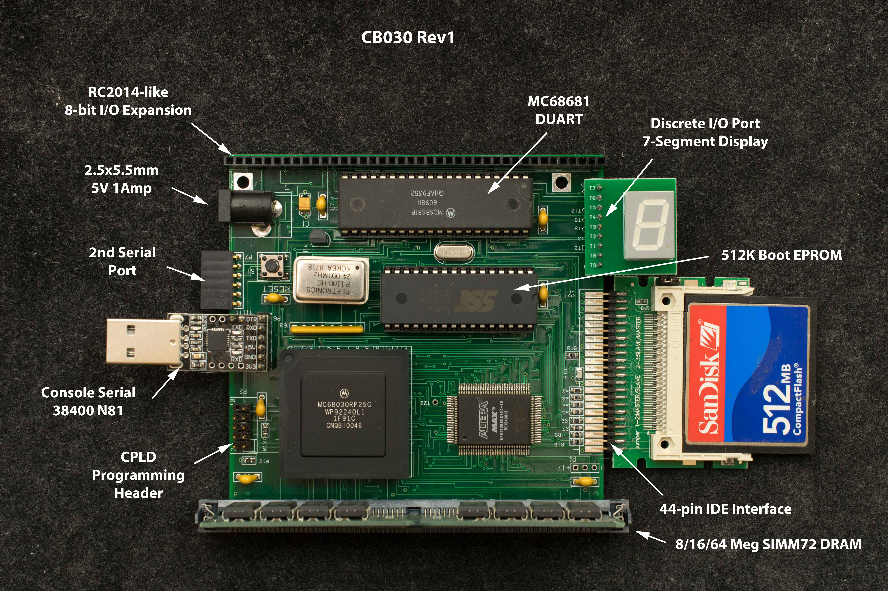

CB030 is named after Cecil B. a 680×0 enthusiast who has motivated me to update the Tiny030 design and made it available to hobbyists. It is based on a 24MHz 68030, 16 Meg DRAM initially but 64/128 Meg final, 512K boot flash, compact flash mass storage, dual serial ports, and an I/O expansion port on a 4“ x 4” pc board. The emphasis is on a capable yet economical foundation that hobbyists can build on. The design will have mostly through-hole components, but to reduce complexity and cost of components and PC board, it will have a surface mounted CPLD as glue logic. The surface mounted CPLD can be assembled and programmed by an individual such as myself or assembly shop and the remainder assembled by the end users.

Features
- 24MHz 68030
- 512K bootstrap EPROM
- 72-pin SIMM, accept 4/8/16/32/64/128 meg
- EPM7128S glue logic
- 68681 DUART with 2 serial ports and discrete I/O
- Console serial interface 38400, N-8-1
- 44-pin IDE Compact Flash interface
- CP/M68K ready
- 8-bit I/O expansion bus
- Economical 4“x4” 2-layer pc board
- 5V 1Amp

Functions

CB030 is simple to build but with sophisticated capabilities. This is possible with an economical but capable Complex Programmable Logic Device (CPLD), Intel (formerly Altera) EPM7128S. All address decode, DRAM controller, dynamic bus sizing, cache interface, and RAM/EPROM remapping are done in the CPLD.

When CB030 is reset or powered on, its entire memory map, except the top 32K of the memory (0xFFFF8000-0xFFFFFFFF) is mapped to the EPROM. The DRAM which is normally located at 0x0 is not accessible. However, by accessing (read or write) a location at 0xFFFF8000, the EPROM is mapped to 0xFE000000-0xFEFFFFFF and DRAM is now visible starting from 0x0.

Design Information
- Schematic
- Gerber photoplot, Rev 1.1
- Bill of Materials
- EPM7128SQC100 design files The CPLD is updated to include an internal 100Hz interrupt source that can be turn on or off under software control. Revision number is now assigned to CPLD. The CPLD with internal 100Hz interrupt is version 1.2
- Memory map
- Discrete I/O port pictorial diagram

Software

- CB030 monitor
- CP/M68K BIOS
- CP/M68K distribution files
- CP/M68K CCP/BDOS
- CF image of CP/M68K files. Copy the image to 512MB or larger CF disk using disk imaging tools like Win32DiskImager
- EPROM programming file for 512Kx8 EPROM
- 16 meg DRAM memory diagnostic
- 64meg DRAM memory diagnostic
